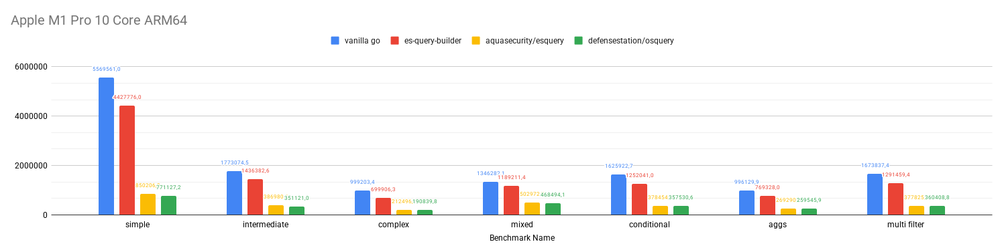
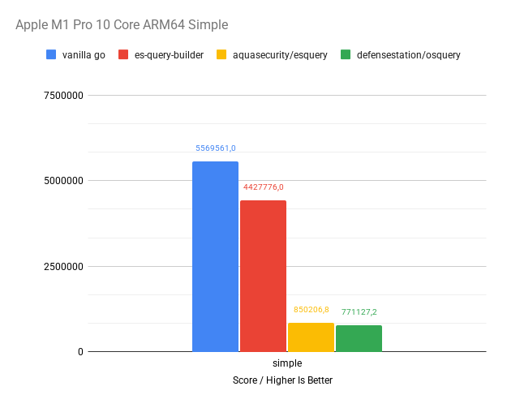
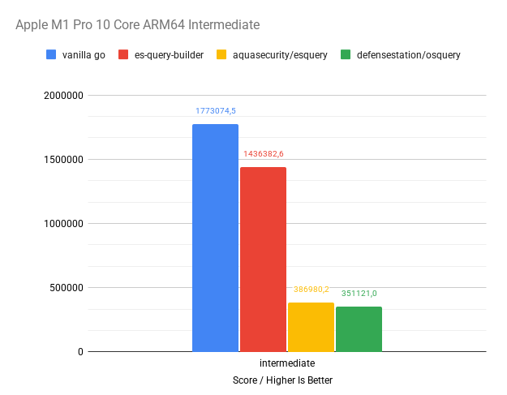
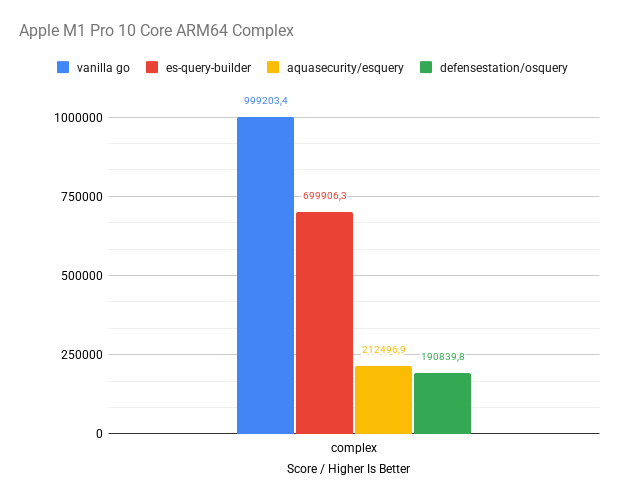
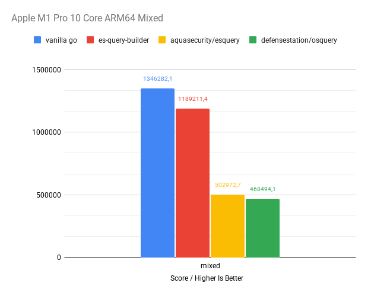

# es-query-builder [![GoDoc][doc-img]][doc] [![Release][release-img]][release] [![Build Status][ci-img]][ci] [![Coverage Status][cov-img]][cov] [![OpenSSF Scorecard][scorecard-img]][scorecard] [![OpenSSF Best Practices][opensff-badge-img]][opensff-badge]

A simple, user-friendly, and streamlined library for programmatically building Elasticsearch DSL queries in Go, designed
for low overhead and minimal memory usage.

## Install
With [Go's module support](https://go.dev/wiki/Modules#how-to-use-modules), `go [build|run|test]` automatically fetches the necessary dependencies when you add the import in your code:

```sh
import "github.com/Trendyol/es-query-builder"
```

Alternatively, use `go get`:

```sh
go get -u github.com/Trendyol/es-query-builder
```

### Example
```json
{
  "query": {
    "bool": {
      "must": [
        {
          "term": {
            "author": "George Orwell"
          }
        }
      ],
      "must_not": [
        {
          "terms": {
            "genre": [
              "Fantasy",
              "Science Fiction"
            ]
          }
        },
        {
          "exists": {
            "field": "out_of_print"
          }
        }
      ],
      "should": [
        {
          "terms": {
            "title": [
              "1984",
              "Animal Farm"
            ]
          }
        }
      ]
    }
  },
  "aggs": {
    "genres_count": {
      "terms": {
        "field": "genre"
      }
    },
    "authors_and_genres": {
      "terms": {
        "field": "author"
      },
      "aggs": {
        "genres": {
          "terms": {
            "field": "genre"
          }
        }
      }
    }
  }
}
```

### With es-query-builder

```go
query := es.NewQuery(
    es.Bool().
        Must(
            es.Term("author", "George Orwell"),
        ).
        MustNot(
            es.Terms("genre", "Fantasy", "Science Fiction"),
            es.Exists("out_of_print"),
        ).
        Should(
            es.Terms("title", "1984", "Animal Farm"),
        )).
	Aggs(
            es.Agg("genres_count", es.TermsAgg("genre")), 
            es.Agg("authors_and_genres", es.TermsAgg("author").
                Aggs(es.Agg("genres", es.TermsAgg("genre"))),
            ),
        )
```

### With vanilla Go

```go
query := map[string]interface{}{
  "query": map[string]interface{}{
    "bool": map[string]interface{}{
      "must": []map[string]interface{}{
        {
          "term": map[string]interface{}{
            "author": "George Orwell",
          },
        },
      },
      "must_not": []map[string]interface{}{
        {
          "terms": map[string]interface{}{
            "genre": []string{
              "Fantasy",
              "Science Fiction",
            },
          },
        },
        {
          "exists": map[string]interface{}{
            "field": "out_of_print",
          },
        },
      },
      "should": []map[string]interface{}{
        {
          "terms": map[string]interface{}{
            "title": []string{
              "1984",
              "Animal Farm",
            },
          },
        },
      },
    },
  },
  "aggs": map[string]interface{}{
    "genres_count": map[string]interface{}{
      "terms": map[string]interface{}{
        "field": "genre",
      },
    },
    "authors_and_genres": map[string]interface{}{
      "terms": map[string]interface{}{
        "field": "author",
      },
      "aggs": map[string]interface{}{
        "genres": map[string]interface{}{
          "terms": map[string]interface{}{
            "field": "genre",
          },
        },
      },
    },
  },
}
```


# Benchmarks

You can check and run [benchmarks](./benchmarks) on your machine.

### ARM64

- **Device**: MacBook Pro 16" 2021
- **OS**: macOS Tahoe 26.6.1 
- **CPU**: Apple Silicon M1 Pro 10 Core
- **Arch**: ARM64
- **Memory**: 32GB LPDDR5
- **Go Version**: go1.26.5
- **es-query-builder Version**: v1.3.0 Alonso
- **Benchmark Date**: 15/08/2026



<details>
  <summary><b>ARM64 Detailed Benchmark Results</b></summary>



- **es-query-builder** is **20.5%** less efficient than **vanilla Go**.
- **[aquasecurity/esquery](https://github.com/aquasecurity/esquery)** is **80.8%** less efficient than **es-query-builder**.
- **[defensestation/osquery](https://github.com/defensestation/osquery)** is **82.6%** less efficient than **es-query-builder**.

Benchmark test file at [simple query benchmark](./benchmarks/tests/simple_benchmark_test.go)

---



- **es-query-builder** is **19%** less efficient than **vanilla Go**.
- **[aquasecurity/esquery](https://github.com/aquasecurity/esquery)** is **73.1%** less efficient than **es-query-builder**.
- **[defensestation/osquery](https://github.com/defensestation/osquery)** is **75.6%** less efficient than **es-query-builder**.

Benchmark test file at [intermediate query benchmark](./benchmarks/tests/intermediate_benchmark_test.go)

---



- **es-query-builder** is **30%** less efficient than **vanilla Go**.
- **[aquasecurity/esquery](https://github.com/aquasecurity/esquery)** is **69.6%** less efficient than **es-query-builder**.
- **[defensestation/osquery](https://github.com/defensestation/osquery)** is **72.7%** less efficient than **es-query-builder**.

Benchmark test file at [complex query benchmark](./benchmarks/tests/complex_benchmark_test.go)

---



- **es-query-builder** is **11.7%** less efficient than **vanilla Go**.
- **[aquasecurity/esquery](https://github.com/aquasecurity/esquery)** is **57.7%** less efficient than **es-query-builder**.
- **[defensestation/osquery](https://github.com/defensestation/osquery)** is **60.6%** less efficient than **es-query-builder**.

Benchmark test file at [mixed query benchmark](./benchmarks/tests/mixed_benchmark_test.go)

---


- **es-query-builder** is **23%** less efficient than **vanilla Go**.
- **[aquasecurity/esquery](https://github.com/aquasecurity/esquery)** is **69.8%** less efficient than **es-query-builder**.
- **[defensestation/osquery](https://github.com/defensestation/osquery)** is **71.4%** less efficient than **es-query-builder**.

Benchmark test file at [conditional query benchmark](./benchmarks/tests/conditional_benchmark_test.go)

---


- **es-query-builder** is **22.8%** less efficient than **vanilla Go**.
- **[aquasecurity/esquery](https://github.com/aquasecurity/esquery)** is **65%** less efficient than **es-query-builder**.
- **[defensestation/osquery](https://github.com/defensestation/osquery)** is **66.3%** less efficient than **es-query-builder**.

Benchmark test file at [multi filter query benchmark](./benchmarks/tests/multi_filter_benchmark_test.go)

---


- **es-query-builder** is **22.8%** less efficient than **vanilla Go**.
- **[aquasecurity/esquery](https://github.com/aquasecurity/esquery)** is **70.7%** less efficient than **es-query-builder**.
- **[defensestation/osquery](https://github.com/defensestation/osquery)** is **72.1%** less efficient than **es-query-builder**.

Benchmark test file at [aggs query benchmark](./benchmarks/tests/aggs_benchmark_test.go)

---

### MacBook M1 Pro 10 Core Benchmark Result Table 
|Benchmark Name     |vanilla go score|vanilla go ns/op|aquasecurity/esquery score|aquasecurity/esquery ns/op|defensestation/osquery score|defensestation/osquery ns/op|es-query-builder score|es-query-builder ns/op|
|-------------------|----------------|----------------|--------------------------|--------------------------|----------------------------|----------------------------|----------------------|----------------------|
|simple             |5.601.488       |428             |858.831                   |2.765                     |774.716                     |3.073                       |4.518.098             |519                   |
|simple             |5.573.905       |430             |855.624                   |2.766                     |763.951                     |3.088                       |4.448.916             |516                   |
|simple             |5.632.969       |428             |849.672                   |2.770                     |766.855                     |3.082                       |4.578.596             |518                   |
|simple             |5.570.119       |428             |862.065                   |2.781                     |779.230                     |3.109                       |4.089.325             |522                   |
|simple             |5.598.224       |430             |849.565                   |2.772                     |775.483                     |3.081                       |4.405.360             |518                   |
|simple             |5.589.698       |437             |858.900                   |2.772                     |764.484                     |3.093                       |4.456.239             |521                   |
|simple             |5.628.938       |428             |847.077                   |2.773                     |778.400                     |3.083                       |4.466.342             |516                   |
|simple             |5.446.045       |429             |855.650                   |2.771                     |776.648                     |3.083                       |4.390.662             |527                   |
|simple             |5.544.520       |442             |805.502                   |2.798                     |754.942                     |3.100                       |4.407.188             |521                   |
|simple             |5.509.704       |424             |859.182                   |2.753                     |776.563                     |3.049                       |4.517.034             |515                   |
|simple avg         |5.569.561       |430             |850.207                   |2.772                     |771.127                     |3.084                       |4.427.776             |519                   |
|simple median      |5.581.802       |428             |855.637                   |2.772                     |775.100                     |3.083                       |4.452.578             |519                   |
|simple stddev      |57.036          |5               |16.462                    |12                        |8.071                       |16                          |132.694               |4                     |
|                   |                |                |                          |                          |                            |                            |                      |                      |
|complex            |1.000.000       |2.447           |212.674                   |11.228                    |190.801                     |12.486                      |716.896               |3.358                 |
|complex            |1.000.000       |2.359           |212.752                   |11.232                    |191.622                     |12.481                      |716.733               |3.360                 |
|complex            |1.000.000       |2.371           |209.548                   |11.346                    |191.323                     |12.560                      |706.281               |3.385                 |
|complex            |998.797         |2.362           |213.108                   |11.317                    |190.521                     |12.472                      |602.426               |3.362                 |
|complex            |996.297         |2.364           |213.736                   |11.286                    |190.927                     |12.490                      |710.406               |3.387                 |
|complex            |1.000.000       |2.388           |212.047                   |11.371                    |190.567                     |12.605                      |700.284               |3.412                 |
|complex            |1.000.000       |2.370           |214.032                   |11.316                    |191.396                     |12.569                      |710.124               |3.384                 |
|complex            |996.940         |2.354           |213.615                   |11.294                    |189.646                     |12.617                      |711.087               |3.377                 |
|complex            |1.000.000       |2.359           |212.094                   |11.293                    |190.834                     |12.688                      |712.810               |3.368                 |
|complex            |1.000.000       |2.398           |211.363                   |11.349                    |190.761                     |12.584                      |712.016               |3.386                 |
|complex avg        |999.203         |2.377           |212.497                   |11.303                    |190.840                     |12.555                      |699.906               |3.378                 |
|complex median     |1.000.000       |2.367           |212.713                   |11.305                    |190.818                     |12.565                      |710.747               |3.381                 |
|complex stddev     |1.421           |28              |1.332                     |47                        |555                         |72                          |34.589                |17                    |
|                   |                |                |                          |                          |                            |                            |                      |                      |
|conditional        |1.632.970       |1.465           |379.843                   |6.343                     |358.028                     |6.661                       |1.257.592             |1.903                 |
|conditional        |1.631.400       |1.475           |380.097                   |6.343                     |359.352                     |6.680                       |1.256.232             |1.909                 |
|conditional        |1.608.992       |1.473           |376.111                   |6.342                     |358.176                     |6.661                       |1.242.354             |1.913                 |
|conditional        |1.638.447       |1.467           |379.758                   |6.344                     |346.220                     |6.666                       |1.236.354             |1.888                 |
|conditional        |1.629.631       |1.470           |378.986                   |6.332                     |355.371                     |6.667                       |1.256.764             |1.905                 |
|conditional        |1.630.388       |1.472           |382.974                   |6.317                     |361.366                     |6.639                       |1.246.576             |1.905                 |
|conditional        |1.629.793       |1.479           |380.817                   |6.367                     |358.315                     |6.691                       |1.250.622             |1.907                 |
|conditional        |1.617.513       |1.480           |374.154                   |6.350                     |361.255                     |6.669                       |1.252.124             |1.911                 |
|conditional        |1.595.280       |1.509           |374.784                   |6.572                     |354.670                     |6.731                       |1.232.862             |1.937                 |
|conditional        |1.644.813       |1.470           |377.019                   |6.415                     |362.553                     |6.773                       |1.288.930             |1.861                 |
|conditional avg    |1.625.923       |1.476           |378.454                   |6.373                     |357.531                     |6.684                       |1.252.041             |1.904                 |
|conditional median |1.630.091       |1.473           |379.372                   |6.344                     |358.246                     |6.668                       |1.251.373             |1.906                 |
|conditional stddev |14.676          |13              |2.831                     |75                        |4.704                       |40                          |15.532                |19                    |
|                   |                |                |                          |                          |                            |                            |                      |                      |
|intermediate       |1.781.358       |1.344           |387.668                   |6.164                     |352.111                     |6.787                       |1.446.952             |1.656                 |
|intermediate       |1.783.054       |1.358           |384.766                   |6.171                     |356.208                     |6.834                       |1.426.935             |1.667                 |
|intermediate       |1.802.826       |1.336           |389.528                   |6.154                     |340.358                     |6.781                       |1.448.636             |1.651                 |
|intermediate       |1.766.487       |1.357           |388.480                   |6.175                     |349.483                     |6.809                       |1.437.428             |1.689                 |
|intermediate       |1.786.352       |1.340           |390.286                   |6.167                     |356.846                     |6.774                       |1.440.844             |1.653                 |
|intermediate       |1.791.645       |1.338           |386.493                   |6.179                     |353.842                     |6.815                       |1.439.215             |1.655                 |
|intermediate       |1.768.275       |1.361           |386.540                   |6.202                     |351.259                     |6.837                       |1.433.521             |1.659                 |
|intermediate       |1.746.514       |1.361           |385.171                   |6.204                     |353.737                     |6.872                       |1.439.204             |1.672                 |
|intermediate       |1.754.444       |1.350           |385.573                   |6.197                     |346.927                     |6.954                       |1.438.772             |1.667                 |
|intermediate       |1.749.790       |1.376           |385.297                   |6.233                     |350.439                     |6.914                       |1.412.319             |1.689                 |
|intermediate avg   |1.773.075       |1.352           |386.980                   |6.185                     |351.121                     |6.838                       |1.436.383             |1.666                 |
|intermediate median|1.774.817       |1.354           |386.517                   |6.177                     |351.685                     |6.825                       |1.438.988             |1.663                 |
|intermediate stddev|18.961          |13              |1.931                     |24                        |4.836                       |59                          |10.441                |14                    |
|                   |                |                |                          |                          |                            |                            |                      |                      |
|mixed              |1.357.543       |1.763           |502.618                   |4.776                     |471.564                     |5.127                       |1.201.346             |1.997                 |
|mixed              |1.337.018       |1.798           |504.010                   |4.762                     |463.848                     |5.112                       |1.193.284             |2.035                 |
|mixed              |1.350.583       |1.779           |501.216                   |4.766                     |468.782                     |5.101                       |1.185.589             |2.010                 |
|mixed              |1.364.649       |1.760           |502.582                   |4.762                     |471.144                     |5.117                       |1.193.355             |2.004                 |
|mixed              |1.241.558       |1.756           |503.500                   |4.752                     |478.230                     |5.094                       |1.192.701             |2.002                 |
|mixed              |1.360.828       |1.772           |501.600                   |4.774                     |469.124                     |5.122                       |1.195.104             |2.002                 |
|mixed              |1.349.850       |1.783           |501.036                   |4.770                     |471.522                     |5.100                       |1.187.887             |2.025                 |
|mixed              |1.372.297       |1.760           |512.925                   |4.749                     |472.622                     |5.094                       |1.193.472             |1.995                 |
|mixed              |1.353.234       |1.768           |499.968                   |4.772                     |458.510                     |5.139                       |1.158.046             |2.008                 |
|mixed              |1.375.261       |1.746           |500.272                   |4.703                     |459.595                     |5.042                       |1.191.330             |1.989                 |
|mixed avg          |1.346.282       |1.769           |502.973                   |4.759                     |468.494                     |5.105                       |1.189.211             |2.007                 |
|mixed median       |1.355.389       |1.766           |502.091                   |4.764                     |470.134                     |5.107                       |1.192.993             |2.003                 |
|mixed stddev       |38.478          |15              |3.738                     |21                        |6.132                       |27                          |11.722                |14                    |
|                   |                |                |                          |                          |                            |                            |                      |                      |
|multifilter        |1.666.894       |1.441           |380.499                   |6.321                     |360.769                     |6.663                       |1.290.612             |1.868                 |
|multifilter        |1.680.933       |1.420           |378.542                   |6.357                     |356.086                     |6.646                       |1.297.905             |1.850                 |
|multifilter        |1.666.359       |1.443           |373.927                   |6.329                     |358.418                     |6.697                       |1.278.561             |1.856                 |
|multifilter        |1.673.036       |1.434           |377.012                   |6.359                     |358.113                     |6.677                       |1.292.317             |1.854                 |
|multifilter        |1.680.190       |1.431           |376.668                   |6.351                     |362.014                     |6.673                       |1.285.486             |1.852                 |
|multifilter        |1.649.924       |1.486           |376.250                   |6.343                     |360.903                     |6.673                       |1.292.306             |1.867                 |
|multifilter        |1.671.050       |1.430           |376.536                   |6.321                     |358.356                     |6.668                       |1.292.410             |1.864                 |
|multifilter        |1.672.260       |1.430           |377.690                   |6.316                     |357.235                     |6.672                       |1.290.283             |1.863                 |
|multifilter        |1.678.980       |1.430           |380.540                   |6.355                     |359.808                     |6.648                       |1.295.148             |1.843                 |
|multifilter        |1.698.748       |1.410           |380.595                   |6.267                     |372.386                     |6.578                       |1.299.566             |1.838                 |
|multifilter avg    |1.673.837       |1.436           |377.826                   |6.332                     |360.409                     |6.660                       |1.291.459             |1.856                 |
|multifilter median |1.672.648       |1.431           |377.351                   |6.336                     |359.113                     |6.670                       |1.292.312             |1.855                 |
|multifilter stddev |12.581          |20              |2.213                     |28                        |4.582                       |32                          |6.031                 |10                    |
|                   |                |                |                          |                          |                            |                            |                      |                      |
|aggs               |1.000.000       |2.378           |274.063                   |8.780                     |262.951                     |9.110                       |668.685               |2.991                 |
|aggs               |998.212         |2.386           |272.784                   |8.826                     |261.975                     |9.145                       |804.202               |2.996                 |
|aggs               |984.826         |2.421           |272.764                   |8.866                     |260.125                     |9.228                       |787.856               |3.044                 |
|aggs               |987.550         |2.426           |271.005                   |8.858                     |260.593                     |9.237                       |751.936               |3.069                 |
|aggs               |997.716         |2.401           |272.236                   |8.842                     |260.133                     |9.200                       |796.714               |3.027                 |
|aggs               |1.000.000       |2.425           |272.035                   |8.876                     |247.887                     |9.209                       |788.214               |3.020                 |
|aggs               |1.000.000       |2.398           |271.501                   |8.860                     |259.821                     |9.162                       |793.214               |3.017                 |
|aggs               |1.000.000       |2.410           |268.878                   |8.839                     |259.484                     |9.142                       |706.188               |3.043                 |
|aggs               |1.000.000       |2.490           |243.608                   |8.806                     |261.716                     |9.123                       |803.244               |2.994                 |
|aggs               |992.995         |2.409           |274.026                   |8.843                     |260.774                     |9.193                       |793.027               |3.029                 |
|aggs avg           |996.130         |2.414           |269.290                   |8.840                     |259.546                     |9.175                       |769.328               |3.023                 |
|aggs median        |999.106         |2.410           |272.136                   |8.843                     |260.363                     |9.178                       |790.621               |3.024                 |
|aggs stddev        |5.705           |31              |9.149                     |29                        |4.236                       |45                          |46.388                |25                    |
</details>


# Want to Contribute?

<details>
  <summary><b>Join Us</b></summary>
  
</details>

###  Contribute to Our Project

Want to help out? Awesome! Here’s how you can contribute:

1. **Report Issues:** Got a suggestion, recommendation, or found a bug? Head over to the [Issues](https://github.com/Trendyol/es-query-builder/issues) section and let us know.

2. **Make Changes:** Want to improve the code?
   - Fork the repo
   - Create a new branch
   - Make your changes
   - Open a Pull Request (PR)

We’re excited to see your contributions. Thanks for helping make this project better!

# License

MIT - Please check the [LICENSE](./LICENSE) file for full text.

[doc-img]: https://godoc.org/github.com/Trendyol/es-query-builder?status.svg

[doc]: https://godoc.org/github.com/Trendyol/es-query-builder

[release]: https://github.com/Trendyol/es-query-builder/releases

[release-img]: https://img.shields.io/github/v/release/Trendyol/es-query-builder.svg

[cov-img]: https://codecov.io/gh/Trendyol/es-query-builder/branch/main/graph/badge.svg

[cov]: https://codecov.io/gh/Trendyol/es-query-builder

[ci-img]: https://github.com/Trendyol/es-query-builder/actions/workflows/build-test.yml/badge.svg

[ci]: https://github.com/Trendyol/es-query-builder/actions/workflows/build-test.yml

[scorecard]: https://scorecard.dev/viewer/?uri=github.com/Trendyol/es-query-builder

[scorecard-img]: https://api.scorecard.dev/projects/github.com/Trendyol/es-query-builder/badge

[opensff-badge]: https://www.bestpractices.dev/projects/11879

[opensff-badge-img]: https://www.bestpractices.dev/projects/11879/badge
